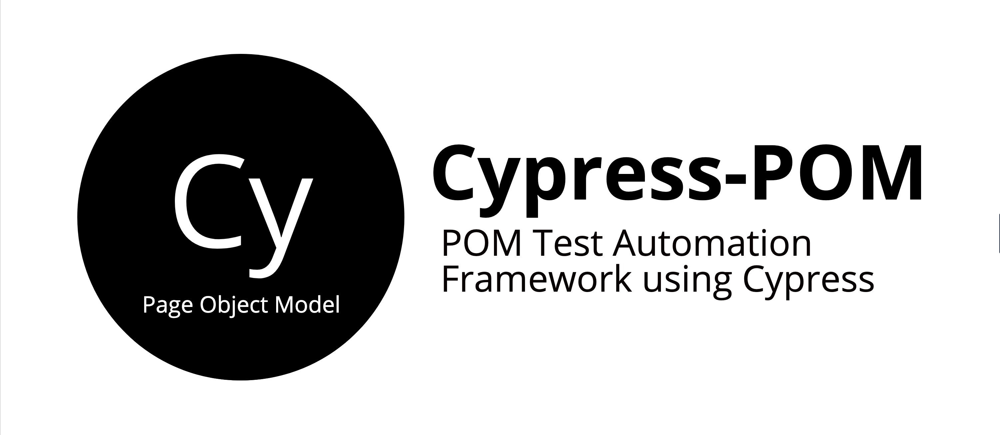

# Cypress Page Object Model Framework

This project is to support Page Object Model (POM) using Cypress. It also supports tagging feature which is not available by default in cypress. For better understanding of tests, allure and mochawsome reporting structure is included with this project structure.


[](LICENSE)
[](https://www.ruby-lang.org/en/)
[]( https://stackoverflow.com/users/10505289/naresh-sekar )
[](CONTRIBUTING.md)
[](mailto:nareshnavinash@gmail.com)




## Supports
* Multiple browser automation
* Allure reports
* Jenkins Integration
* Modes of run via CLI command
* Headless run
* Docker Execution
* Failed Screenshots
* Testdata driven tests
* Tagging the tests
* Retries of failed tests

## Pending
* Multi browser automation
* Multi Thread run


## Setup
* Clone this repository
* Navigate to the cloned folder
* Install node and npm using `brew install node`
* Install the dependencies with respect to this project by `npm install`


## To Run the tests

To make the command line run options easier, added common run options as scripts in `package.json` file.

For a simple run of all the feature files in normal mode without any video recording, try
```
npm run test
```
For a simple run of all the feature files in normal mode with video recording, try
```
npm run test:video
```
To run the tests with specific spec file, try
```
npm run test -- --spec <Path to the spec file>
```

### Tags

Cypress by default doesn't support any tagging feature to the tests. I have included a wrapper under `support/test-filter.js` and included that wrapper in every tests to specify the tags. Have this wrapper on top of every test description inside the test file. 
```
TestFilter.any(['smoke', 'regression', ''], () => { // Specify the tags within this array
    it('Sample test', () => {
      // Test description
    })
  })
```
Make sure to have the empty string within the tag array, so that if no tags is specified in the test run to this testcase runs by default. To run the tests specific with any tags, try
```
npm run test -- --env TEST_TAGS=regression
```

### Headless

To run the tests in headless mode,
```
npm run test -- --headless
```
To run the tests in headed mode,
```
npm run test -- --headed
```

## Allure
To open the allure results,
```
npm run serve-allure
```
To clear the allure results,
```
npm run clean-allure
```

## Multiple Browser
Multiple browser is supported by cypress by default to run the tests against any specific browser, try

```
npm run -- --browser <Browser name or path eg., chrome, firefox>
```

## Reports
For better illustration on the testcases, allure reports and mochawsome has been integrated. Allure reports can also be integrated with jenkins to get a dashboard view. Apart from allure and mochawsome, command line is also integrated in such a way that cy.log is printed in the console.

## Jenkins Integration with Docker images
Get any of the linux with cypress docker image as the slaves in jenkins and use the same for executing the UI automation with this framework (Sample docker image - `https://hub.docker.com/r/cypress/browsers`). From the jenkins bash Execute the following to get the testcases to run,
```
#!/bin/bash -l
npm list
ls
cd <path_to_the_project>
npm install
npm run test <or custom run option>
```

In Jenkins pipeline, try to add the following snippet to execute the tests,
```
pipeline {
    agent { docker { image 'cypress/browsers' } }
    stages {
        stage('build') {
            steps {
                sh 'cd project/'
                sh 'npm install'
                sh 'npm run test' # or custom methods
            }
        }
    }
}
```

## Retries
By default this project is specified to have retry count with 2. This can be changed by modifying the environment variable `"RETRIES": 2,` in `cypress.json` file. If in case you wish to have multiple retries for a specific testcase, you can add the following within the testcases,
```
Cypress.currentTest.retries(4)
```


## Breakdown in to testcases

### Adding page methods to the project

1. Add page specific methods inside the `pages` folder structure. Pages are declared in namespaces so that we can directly call them within the tests without any declarations. Name the page files with `<spec_name>.pages.js` so that we wont get confused with the file functionality.

```
var ActionsPage = {
    enter_email: function(email) {
        cy.get(ActionsLocator.email())
        .type(email).should('have.value', email)
    },
}

```

2. For each page add make sure a locator page is added and included within the page file. We need to declare the locator identifiers within the locator file and then need to use that in pages.

```
import ActionsLocator from '../locators/actions.locator';
```

### Adding locator methods to the project 

1. Add locator methods inside the `locators` folder structure. Locators are declared in namespaces so that we can directly call them within the tests or within the pages without any prior declarations. Name the page files with `<spec_name>.locators.js` so that we wont get confused with the file functionality.

```
var ActionsLocator = {
    email: function() {
           return '.action-email'
    }
};

```

2. For each page add make sure a locator page is added and included within the page file. We need to declare the locator identifiers within the locator file and then need to use that in pages.

```
import ActionsLocator from '../locators/actions.locator';
```

### Creating a new spec file in the project

1. Spec files are created by default cypress standard and we could use all the hooks and definitions that are supported by cypress.

2. Only changes that we need to do is to add the tags to the tests using the `TestFilter` custom wrapper. This helps us to run the tests by using tags. A very common usecase is to run the tests in regression or sanity mode to validate the application's stability at different situations.

3. Global hooks are added within the `support/hooks.js` which is included in the `support/index.js` file. Here we could add any common actions among all the test cases at global level. A very common use case is to run the tests against different environment, for which we can pass the environment as a command line argument (or as an environment variable) and parse the same to declare the URL's which has to be consumed inside the tests.

## Parallelization (Multi Thread run)

Cypress makes it a complex process to parallelize the tests since their billing revolvs around this feature. If we compare the other parallelization modules in Ruby or Python the number of parallel nodes is dependent on the number of cores of CPU. But here, we ought to specify a CI tool will different machines in the cloud. If we need to run two parallel mode within a machine, cypress doesn't support that.

## Multi browser automation

Its not possible to launch another browser instance with cypress. Traditionally we could launch multiple browser instance with different specifications to test the web applications. For Synchronous applications like real time chat bot, cloud call center etc., we ought to have multiple browsers launched at the same time. This flexibility is not visible here in cypress.

## Built With

* [Cypress](https://www.cypress.io/) - Automation core framework
* [Allure](https://www.npmjs.com/package/@shelex/cypress-allure-plugin) - For Detailed reporting.

## Contributing

1. Clone the repo!
2. Create your feature branch: `git checkout -b my-new-feature`
3. Commit your changes: `git commit -am 'Add some feature'`
4. Push to the branch: `git push origin my-new-feature`
5. Create a pull request.

Please read [CONTRIBUTING.md](CONTRIBUTING.md) for details on code of conduct, and the process for submitting pull requests.

## Authors

* **[Naresh Sekar](https://github.com/nareshnavinash)**

## License

This project is licensed under the GNU GPL-3.0 License - see the [LICENSE](LICENSE) file for details

## Acknowledgments

* To all the open source contributors whose code has been referred in this project.
