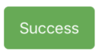

import Tabs from '@theme/Tabs';
import TabItem from '@theme/TabItem';

Migrating to v3 will provide a lot more **design**, **size**, **color** and **customisation** option.

## Overview

Migrating Button components can broadly described in these points:

- No need to wrap you text inside text component anymore.
- `isDisabled` is the new prop which when **true** disable's the button.
- Icons in Button:
  `leftIcon` and `rightIcon` the new alternative to iconLeft and iconRight respectively, and now it accepts **tsx.Element**.
- Colors of the Buttons:
  In v3 the color is controlled by `colorScheme` prop. So all the color providing props [ **light**, **info**, **success**, **warning**, **danger** and **dark** ] can be passed as value (and more) to `colorScheme` props.
- Design of the Button:
  With v3 were providing some mostly frequently used design as `variants` [ like **solid**, **outline**, **ghost**, **link** and **unstyled** ] and lot more customisation.
- Sizes of the Button:
  In v3 the size is controlled by `size` prop. And it accepts pre-defined sizes [ like xs, sm md, lg ] and also custom values.

## Code Comparison

## Colors to the Button

Besides option like **light**, **info**, **success**, **warning**, **danger** and **dark**. Now you can also provide colors like **red**, **blue**, **cyan**, **teal** and a lot more.

<Tabs
defaultValue="v2"
values={[
{label: 'v2', value: 'v2'},
{label: 'v3', value: 'v3'},
]}>
<TabItem value="v2">



```tsx
<Button success>
  <Text>Success</Text>
</Button>
```

</TabItem>
<TabItem value="v3">


```tsx
<Button colorScheme='success'>Success</Button>
```

</TabItem>
</Tabs>

### Sizes of the Button:

Besides option like **light**, **info**, **success**, **warning**, **danger** and **dark**. Now you can also provide colors like **red**, **blue**, **cyan**, **teal** and a lot more.

<Tabs
defaultValue="v2"
values={[
{label: 'v2', value: 'v2'},
{label: 'v3', value: 'v3'},
]}>
<TabItem value="v2">


```tsx
<Button small primary>
  <Text>Default Small</Text>
</Button>
```

</TabItem>
<TabItem value="v3">


```tsx
<Button size='sm' colorScheme='default'>
  Default Small
</Button>
```

</TabItem>
</Tabs>

### Designing the Button

With v3 you can combine variants and style props to create various designs.

<Tabs
defaultValue="v2"
values={[
{label: 'v2', value: 'v2'},
{label: 'v3', value: 'v3'},
]}>
<TabItem value="v2">


```tsx
<Button bordered success>
  <Text>Success</Text>
</Button>
```


```tsx
<Button transparent success>
  <Text>Success</Text>
</Button>
```


```tsx
<Button rounded success>
  <Text>Success</Text>
</Button>
```

</TabItem>
<TabItem value="v3">


```tsx
<Button variant='outline' colorScheme='success'>
  Success
</Button>
```


```tsx
<Button variant='ghost' colorScheme='success'>
  Success
</Button>
```


```tsx
<Button borderRadius='pill' colorScheme='success'>
  Success
</Button>
```

</TabItem>
</Tabs>

### Icon Button

With v3 iconLeft and iconRight can now accepts tsx.Element as child and render the element at the appropriate place.

<Tabs
defaultValue="v2"
values={[
{label: 'v2', value: 'v2'},
{label: 'v3', value: 'v3'},
]}>
<TabItem value="v2">


```tsx
<Button iconLeft dark>
  <Icon name='cog' />
  <Text>Settings</Text>
</Button>
```

</TabItem>
<TabItem value="v3">


```tsx
<Button
  leftIcon={<Icon name='cog-outline' type='Ionicons' color='white' />}
  colorScheme='dark'
>
  Settings
</Button>
```

</TabItem>
</Tabs>
